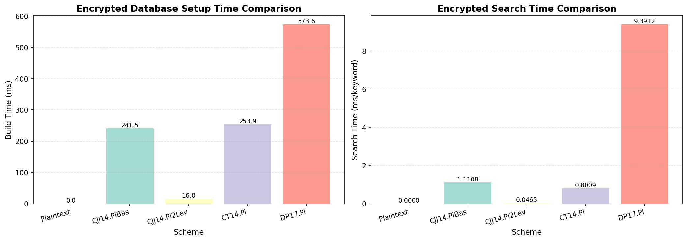
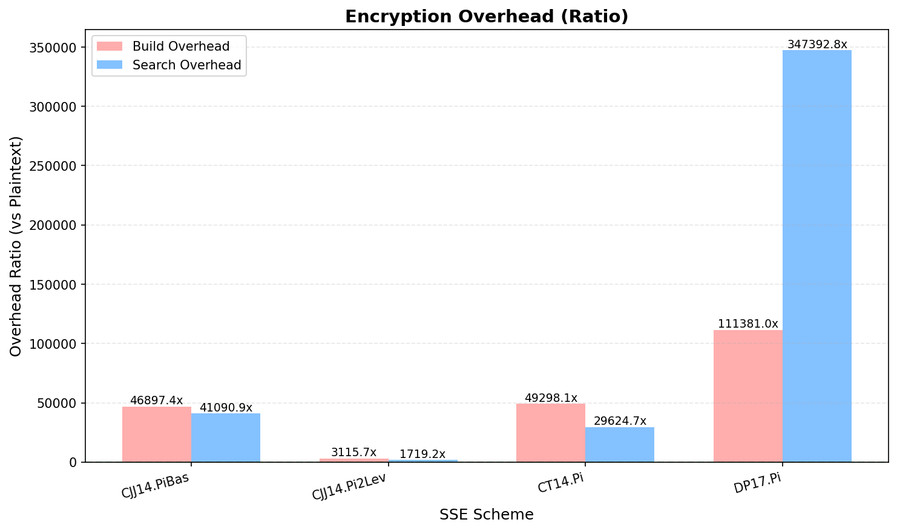
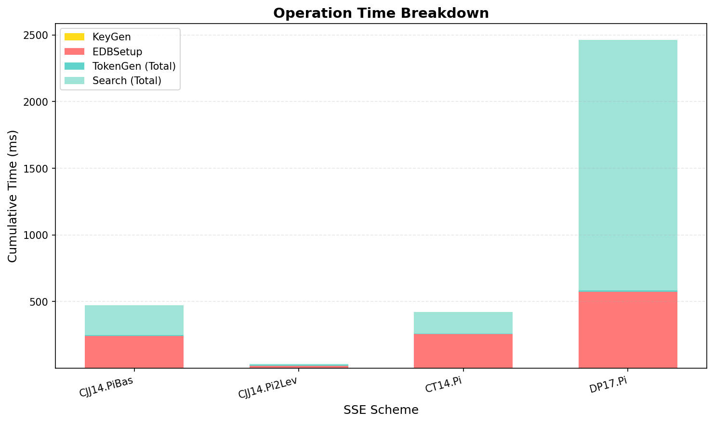

# SSEPy: Implementation of searchable symmetric encryption in pure Python


Source Code: https://github.com/JezaChen/SSEPy

Searchable symmetric encryption, one of the research hotspots in applied cryptography, has continued to be studied for two decades. A number of excellent SSE schemes have emerged, enriching functionality and optimizing performance. However, many SSE schemes have not been implemented concretely and are generally stuck in the prototype implementation stage, and worse, most SSE schemes are not publicly available in source code. Based on this foundation, this project first implements SSE schemes (first single-keyword, then multi-keyword) published in top conferences and journals, and then implements them into concrete applications. I hope that this project will provide a good aid for researchers as well as a reference for industry.

This is a project that is moving forward...

## Usage

### 1) Environment

- Python 3.8+
- OpenSSL
- libffi
- build-essential (Debian/Ubuntu) or build-base (Alpine)

Install dependencies:

```bash
python3 -m venv .venv
.venv/bin/pip install -r requirements.txt
```

Run commands through the local virtual environment:

```bash
.venv/bin/python run_server.py --help
.venv/bin/python run_client.py --help
```

If you prefer a one-liner after the venv is created:

```bash
source .venv/bin/activate
pip3 install -r requirements.txt
```

### 2) Global configuration

Edit `global_config.py`:

```python
import logging

# FOR CLIENT
class ClientConfig:
    SERVER_URI = "ws://localhost:8001"
    CONSOLE_LOG_LEVEL = logging.WARNING
    FILE_LOG_LEVEL = logging.INFO

# FOR SERVER
class ServerConfig:
    HOST = ""
    PORT = 8001
```

To print millisecond timing logs (encryption/decryption/search/update/delete),
set log level to `DEBUG` (client and/or server).

### 3) Start server

```bash
python3 run_server.py start
```

---

## Client usage (CLI)

`run_client.py` now supports:

- Base workflow (config/key/encrypt/upload)
- Single-key search
- Multi-key search
- Delete data
- Update data

### Step 1: Generate config file

```bash
python3 run_client.py generate-config --scheme CJJ14.PiBas --save-path cjj14_config
```

### Step 2: Create service

```bash
python3 run_client.py create-service --config cjj14_config --sname pibas_s0
```

### Step 3: Upload config

```bash
python3 run_client.py upload-config --sname pibas_s0
```

### Step 4: Generate key

```bash
python3 run_client.py generate-key --sname pibas_s0
```

### Step 5: Encrypt database

Standard inverted-index format:

```bash
python3 run_client.py encrypt-database --sname pibas_s0 --db-path example_db.json
```

Database JSON format example:

```json
{
  "China": ["3A4B1ACC", "2DDD1FFF", "1122AA4B", "C2C2C2C2"],
  "Github": ["1A1ADD2C", "2222CC1F"],
  "Chen": ["1BB2BB2B", "23327878", "88771ABB"]
}
```

#### 多key索引加密

同一段数据可以绑定多个检索key，使用其中任意一个key检索都能找到该数据：

```bash
python3 run_client.py encrypt-database-multi-key --sname pibas_s0 --db-path example_multi_key_db.json
```

多key索引数据库 JSON 格式示例 (`example_multi_key_db.json`)：

```json
[
  {
    "keys": ["China", "中国", "CN"],
    "values": ["3A4B1ACC12AA1B2D", "2DDD1FFF1122BBCC"]
  },
  {
    "keys": ["Github", "代码托管"],
    "values": ["1A1ADD2C2320A1CC", "2222CC1F1421A22A"]
  },
  {
    "keys": ["Chen", "陈"],
    "values": ["1BB2BB2B1010112A", "233278781010212C", "88771ABB101AA02B"]
  }
]
```

上例中，`"3A4B1ACC12AA1B2D"` 和 `"2DDD1FFF1122BBCC"` 会同时被索引到 `"China"`、`"中国"`、`"CN"` 三个关键字下。
搜索 `"China"` 或 `"中国"` 或 `"CN"` 都能返回 `["3A4B1ACC12AA1B2D", "2DDD1FFF1122BBCC"]`。

### Step 6: Upload encrypted database

```bash
python3 run_client.py upload-encrypted-database --sname pibas_s0
```

### Step 7: Single-keyword search

搜索单个keyword（多key索引加密后的数据也使用此命令搜索）：

```bash
python3 run_client.py search --keyword Chen --sname pibas_s0 --output-format raw
```

如果是多key索引加密的数据库，搜索 `"China"` 或 `"中国"` 或 `"CN"` 都能找到相同的数据：

```bash
python3 run_client.py search --keyword China --sname pibas_s0 --output-format hex
python3 run_client.py search --keyword 中国 --sname pibas_s0 --output-format hex
python3 run_client.py search --keyword CN --sname pibas_s0 --output-format hex
```

### Bridge export boundary

For the fully bootstrapped repository-level live demo, run [scripts/run_live_sse_bridge_demo.sh](/home/llvanion/Desktop/seccomp-privacy-platform/scripts/run_live_sse_bridge_demo.sh) from the repo root. That wrapper starts or reuses the local SSE server, bootstraps a fresh SSE service, creates normalized demo sources plus encrypted record stores, and runs the end-to-end pipeline.

`run_client.py export-bridge-records` is the controlled local export entrypoint used by the SSE -> bridge -> A-PSI pipeline. For non-ad-hoc runs, pass a caller, policy config, audit log, and job ID:

```bash
.venv/bin/python run_client.py export-bridge-records \
  --source-path examples/bridge_client_records.jsonl \
  --out-path exports/client_demo.csv \
  --role client \
  --source-format jsonl \
  --out-format csv \
  --join-key-field email \
  --value-field amount \
  --filter campaign=demo \
  --caller auto_demo \
  --policy-config config/export_policy.example.json \
  --audit-log exports/export_audit.jsonl \
  --job-id auto_demo_job
```

The policy file can restrict caller, role, join-key/value fields, required filters, allowed filter values, and export row counts. Policy config is required by default; local one-off exports must pass `--unsafe-allow-no-policy` explicitly. The audit log records hashes and row counts, not raw join-key values.

For an SSE-backed candidate export, pass an SSE keyword and the source-record field that carries the SSE result identifier:

```bash
.venv/bin/python run_client.py export-bridge-records \
  --source-path examples/bridge_client_records.jsonl \
  --out-path exports/client_demo.csv \
  --role client \
  --source-format jsonl \
  --out-format csv \
  --join-key-field email \
  --value-field amount \
  --filter campaign=demo \
  --caller auto_demo \
  --policy-config config/export_policy.example.json \
  --audit-log exports/export_audit.jsonl \
  --job-id auto_demo_job \
  --sse-keyword demo \
  --record-id-field email_hex \
  --record-id-format hex \
  --sname bridge_sse_demo
```

In this mode the client queries the SSE service first, converts the returned identifiers with `--record-id-format`, then exports only local source rows whose `--record-id-field` is in that SSE candidate set. It keeps the same policy and audit checks and records `candidate_source=sse_query`, `record_id_field`, and `candidate_count`.

To reduce plaintext source-file exposure, first build an encrypted record store. The passphrase is read from an environment variable and is not accepted on the command line:

```bash
export SSE_RECORD_STORE_PASSPHRASE=<passphrase>
.venv/bin/python run_client.py create-encrypted-record-store \
  --source-path examples/bridge_client_records.jsonl \
  --out-path exports/client_records.enc.jsonl \
  --source-format jsonl \
  --record-id-field email_hex \
  --key-env SSE_RECORD_STORE_PASSPHRASE
```

Then export from the encrypted store after SSE candidate search:

```bash
.venv/bin/python run_client.py export-bridge-records \
  --record-store-path exports/client_records.enc.jsonl \
  --record-store-key-env SSE_RECORD_STORE_PASSPHRASE \
  --out-path exports/client_demo.csv \
  --role client \
  --source-format jsonl \
  --out-format csv \
  --join-key-field email \
  --value-field amount \
  --filter campaign=demo \
  --caller auto_demo \
  --policy-config config/export_policy.example.json \
  --audit-log exports/export_audit.jsonl \
  --job-id auto_demo_job \
  --sse-keyword demo \
  --record-id-field email_hex \
  --record-id-format hex \
  --sname bridge_sse_demo
```

The store uses PBKDF2HMAC-SHA256 and AES-256-GCM. Per-record lookup uses keyed HMAC tags instead of raw record IDs, so the store does not write raw email, phone, device ID, or their hex identifiers as row selectors.

To move recovery behind a longer-lived local boundary, start the Unix-socket recovery service first:

```bash
export SSE_RECORD_RECOVERY_TOKEN=<token>
.venv/bin/python run_client.py serve-record-recovery \
  --socket-path /tmp/sse_record_recovery.sock \
  --socket-mode 600 \
  --auth-token-env SSE_RECORD_RECOVERY_TOKEN \
  --allowed-caller auto_demo \
  --allowed-output-root /tmp \
  --allowed-record-store-root "$PWD/exports" \
  --audit-log /tmp/sse_record_recovery_service_audit.jsonl \
  --pid-file /tmp/sse_record_recovery_service.pid \
  --ready-file /tmp/sse_record_recovery_service.ready
```

Then point `export-bridge-records` at that service:

```bash
export SSE_RECORD_RECOVERY_TOKEN=<token>
.venv/bin/python run_client.py export-bridge-records \
  --record-store-path exports/client_records.enc.jsonl \
  --record-store-key-env SSE_RECORD_STORE_PASSPHRASE \
  --record-recovery-socket /tmp/sse_record_recovery.sock \
  --record-recovery-auth-env SSE_RECORD_RECOVERY_TOKEN \
  --out-path exports/client_demo.csv \
  --role client \
  --source-format jsonl \
  --out-format csv \
  --join-key-field email \
  --value-field amount \
  --filter campaign=demo \
  --caller auto_demo \
  --policy-config config/export_policy.example.json \
  --audit-log exports/export_audit.jsonl \
  --job-id auto_demo_job \
  --sse-keyword demo \
  --record-id-field email_hex \
  --record-id-format hex \
  --sname bridge_sse_demo
```

This keeps the same policy and audit behavior while moving encrypted-store recovery out of the export process. SSE export audit records `record_recovery_boundary=service_socket` for this path. The service can also enforce a caller allowlist and emit `sse_record_recovery_service_audit/v1` records.

### Step 8: Multi-keyword batch search

一次性搜索多个keyword，返回每个keyword的独立结果：

```bash
python3 run_client.py multi-search --sname pibas_s0 --keyword Chen --keyword Github --keyword China --output-format hex
```

### Step 9: Delete data

Delete by keyword:

```bash
python3 run_client.py delete-data --sname pibas_s0 --keyword Chen
```

Delete by indices:

```bash
python3 run_client.py delete-data --sname pibas_s0 --indices 0,1,2
```

### Step 10: Update data

Update with keyword and encrypted payload:

```bash
python3 run_client.py update-data --sname pibas_s0 --keyword Chen --encrypted-data-hex 001122aabbcc
```

Update with JSON entries:

```bash
python3 run_client.py update-data --sname pibas_s0 --entries-json "[{\"addr\":\"6161\",\"value\":\"6262\"}]"
```

---

## Extended features (Python API)

Extended APIs are implemented in `frontend/client/commands.py` and `frontend/client/services/service.py`.

### A. 多key索引加密

同一段数据绑定多个检索key，搜索任意一个key即可命中：

```python
import asyncio
from frontend.client import commands

async def demo():
    # 多key索引数据库格式
    multi_key_db = [
        {
            "keys": ["China", "中国", "CN"],
            "values": ["3A4B1ACC12AA1B2D", "2DDD1FFF1122BBCC"]
        },
        {
            "keys": ["Github", "代码托管"],
            "values": ["1A1ADD2C2320A1CC"]
        }
    ]
    # 加密并索引到多key
    commands.encrypt_database_multi_key(
        multi_key_db=multi_key_db,
        sname="pibas_s0"
    )
    # 上传后，搜索任意一个key即可找到对应数据
    await commands.search(keyword="中国", output_format="hex", sname="pibas_s0")
    await commands.search(keyword="CN", output_format="hex", sname="pibas_s0")
    # 两次搜索返回相同结果

asyncio.run(demo())
```

也可以通过低层 Service API：

```python
from frontend.client.services.service import Service
from schemes.CJJ14.PiBas.config import DEFAULT_CONFIG

service = Service()
service.handle_create_config(DEFAULT_CONFIG)
service.handle_create_key()
service.handle_encrypt_database_multi_key(multi_key_db)
```

### B. Multi-keyword batch search

一次性搜索多个keyword（注意：这是批量搜索，与多key索引是不同的功能）：

```python
import asyncio
from frontend.client import commands

async def demo():
    await commands.multi_search(
        keywords=["Chen", "Github", "China"],
        output_format="hex",
        sname="pibas_s0"
    )

asyncio.run(demo())
```

### C. Delete data

Delete by keyword (server will derive token and process delete path):

```python
import asyncio
from frontend.client import commands

async def demo():
    await commands.delete_data(keyword="Chen", sname="pibas_s0")

asyncio.run(demo())
```

Delete by indices (if the selected encrypted DB backend supports direct index deletion):

```python
import asyncio
from frontend.client import commands

async def demo():
    await commands.delete_data(indices=[0, 1], sname="pibas_s0")

asyncio.run(demo())
```

### D. Update data

Update by keyword:

```python
import asyncio
from frontend.client import commands

async def demo():
    await commands.update_data(
        keyword="Chen",
        encrypted_data=b"new_encrypted_payload",
        sname="pibas_s0"
    )

asyncio.run(demo())
```

Update by entry list:

```python
import asyncio
from frontend.client import commands

async def demo():
    await commands.update_data(
        entries=[
            {"addr": b"address_1", "value": b"cipher_1"},
            {"addr": b"address_2", "value": b"cipher_2"}
        ],
        sname="pibas_s0"
    )

asyncio.run(demo())
```

### E. Run complete example script

`example_usage.py` demonstrates:

1. 多key索引检索（核心功能：同一数据绑定多key，搜索任意key均可命中）
2. 基础流程 + 单keyword检索
3. 删除数据
4. 更新数据

Run:

```bash
python3 example_usage.py
```

---

## Millisecond timing logs

Timing logs are printed with millisecond precision and written into logger files under:

- Linux/macOS: `~/.sse/log/`
- Windows: `%USERPROFILE%/.sse/log/`

Recommended settings for debug timing:

```python
import logging

class ClientConfig:
    CONSOLE_LOG_LEVEL = logging.DEBUG
    FILE_LOG_LEVEL = logging.DEBUG

class ServerConfig:
    # host/port unchanged
    pass
```

---

## Notes on scheme support

- **多key索引**：在加密阶段将同一段数据索引到多个keyword下，搜索时使用标准的单keyword搜索即可。
- **批量搜索（Multi-keyword batch search）**：一次性发送多个keyword并行搜索。
- Delete/Update availability depends on the selected SSE construction and encrypted DB capabilities.
- If a scheme does not implement corresponding operations, server may return a clear "not support" reason.

---

## Benchmark Results

Sample benchmark artifacts generated in `benchmark_results/`:

- JSON result: [benchmark_results/benchmark_20260303_143616.json](benchmark_results/benchmark_20260303_143616.json)

### Time Comparison



### Overhead Comparison



### Operation Breakdown



## Implemented schemes

### Single-keyword Static SSE Schemes

- (Completed) SSE-1 and SSE-2 in \[CGKO06\]: Curtmola, Reza, et al. "Searchable symmetric encryption: improved definitions and efficient constructions." Proceedings of the 13th ACM conference on Computer and communications security. 2006.
- (Completed) Schemes PiBas, PiPack, PiPtr and Pi2Lev in \[CJJ+14\]: Cash, David, et al. "Dynamic Searchable Encryption in Very-Large Databases: Data Structures and Implementation." (2014).
- (Completed) Scheme Pi in \[CT14\]: Cash, David, and Stefano Tessaro. "The locality of searchable symmetric encryption." Annual international conference on the theory and applications of cryptographic techniques. Springer, Berlin, Heidelberg, 2014.
- (Completed) Scheme 3 (Section 5, Construction 5.1) in \[ANSS16\]: Asharov, Gilad, et al. "Searchable symmetric encryption: optimal locality in linear space via two-dimensional balanced allocations." Proceedings of the forty-eighth annual ACM symposium on Theory of Computing. 2016.
- (Completed) Scheme in \[DP17\]: Demertzis, Ioannis, and Charalampos Papamanthou. "Fast searchable encryption with tunable locality." Proceedings of the 2017 ACM International Conference on Management of Data. 2017.
